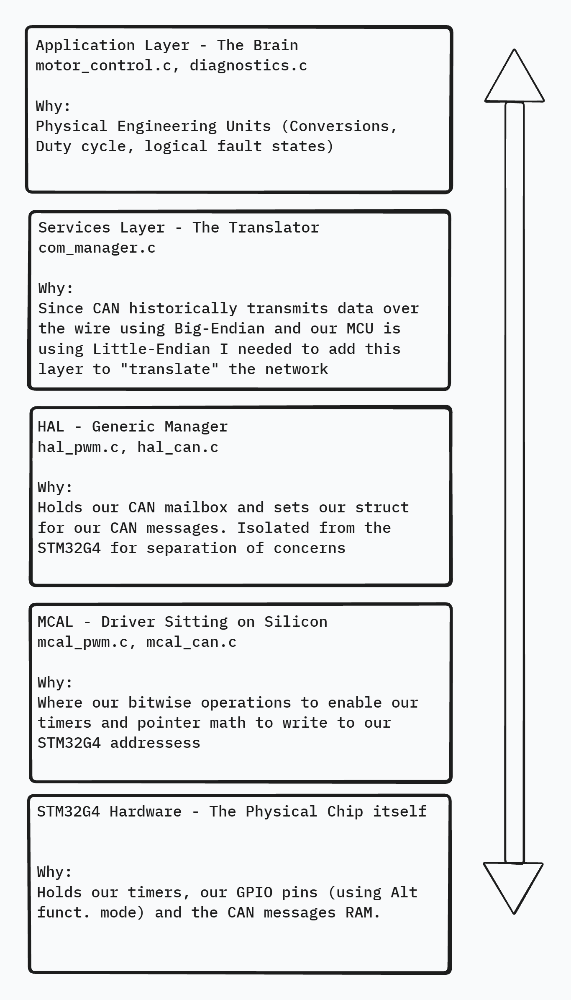

# ECU Firmware & HIL Simulator Thesis  

# ASIL-D Compliant Motor Control ECU

This repository contains the firmware for a safety-critical, closed-loop motor control ECU built on the STM32G4 microcontroller. 

The goal of this ECE honors thesis project was to step away from the standard "single-file" university coding approach and architect a production-grade, highly modular firmware stack. I designed this system to isolate control mathematics from physical hardware registers as I saw with production ready code, ensuring the firmware is portable, testable, and robust against the electrical noise and hardware faults common in automotive and manufacturing environments.

## System Architecture

To enforce strict separation of concerns, the firmware is divided into four distinct layers. This allows the core control logic to be not be dependent on your hardware choices. 

*   **Application Layer (`motor_control.c`, `diagnostics.c`):** The brain of the ECU. This layer strictly handles physical engineering units (target RPM, duty cycle percentages) and logical fault states. It contains the PI controller, ramp generators, and the central Fault Manager.
*   **Services / COM Layer (`com_manager.c`):** The network translator. Because automotive CAN buses transmit data in Big-Endian (Network Byte Order) and the STM32 utilizes Little-Endian memory, this layer utilizes C unions to safely serialize 32-bit floats into 8-byte network payloads without data corruption.
*   **Hardware Abstraction Layer / HAL (`hal_pwm.c`, `hal_can.c`):** Hardware manager. It defines universal data structures and manages transmission mailboxes. This layer does not care about specific microcontroller being used.
*   **Microcontroller Abstraction Layer / MCAL (`mcal_pwm.c`, `mcal_can.c`):** The silicon driver. This is the only layer permitted to touch the physical STM32G4 hardware. It uses strict bitwise operations and pointer math to configure Timer alternate functions, route RCC clocks, and load the CAN Message RAM.

## Safety & Defense-in-Depth

Working with high-power motor control requires assuming the hardware will eventually glitch or fail. I implemented several ASIL-D inspired safety mechanisms to protect the system:
*   **Hamming-Distance State Machines:** Instead of relying on standard `bool` variables (which can be flipped by a single bit because things outside of our control such as EMI and cosmic rays), critical fault states utilize enums with high Hamming distance (e.g., `0x55` vs `0xAA`).
*   **Dynamic Diagnostics Matrix:** Fault tables are sized dynamically using trailing enum boundaries (`MAX_DIAGNOSTICS`). Every diagnostic includes strict bounds to prevent out-of-bounds memory reads from triggering fake safety events.
*   **Saturation Clamping & Overrides:** The MCAL strictly clamps all incoming PWM requests to safe hardware limits (0-100%), acting as a final defense layer even if the Application Layer math underflows or requests bad logic. If an active fault (like encoder loss) is detected, the control effort is instantly forced to a 0.0f safe state before hitting the MCU itself.

## Hardware Stack
*   **Microcontroller:** STM32G474 (170 MHz Core) 
*   **Communications:** Classic CAN 2.0 (via CANable V2.0 Pro adapter)
*   **Sensors:** Hardware-decoded Quadrature Encoder (Timer 2)